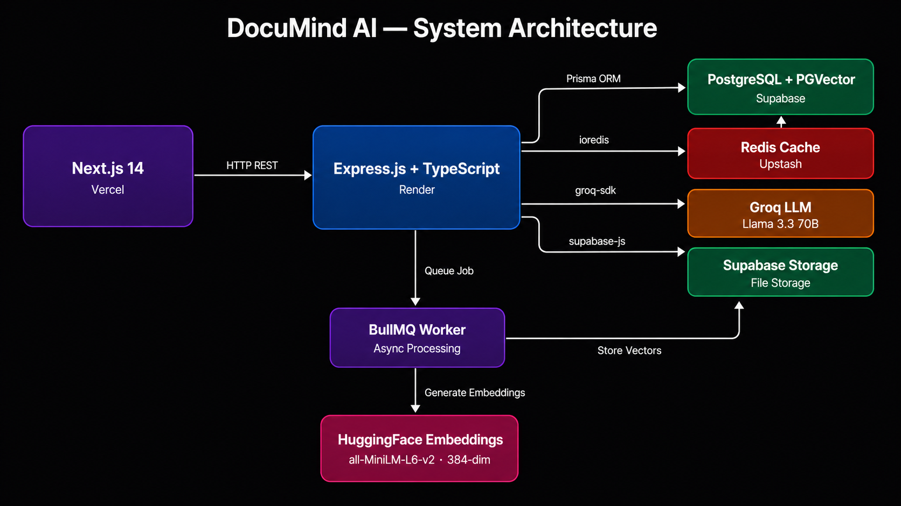
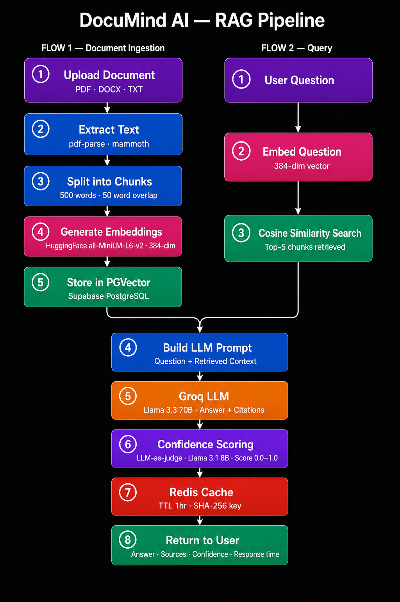
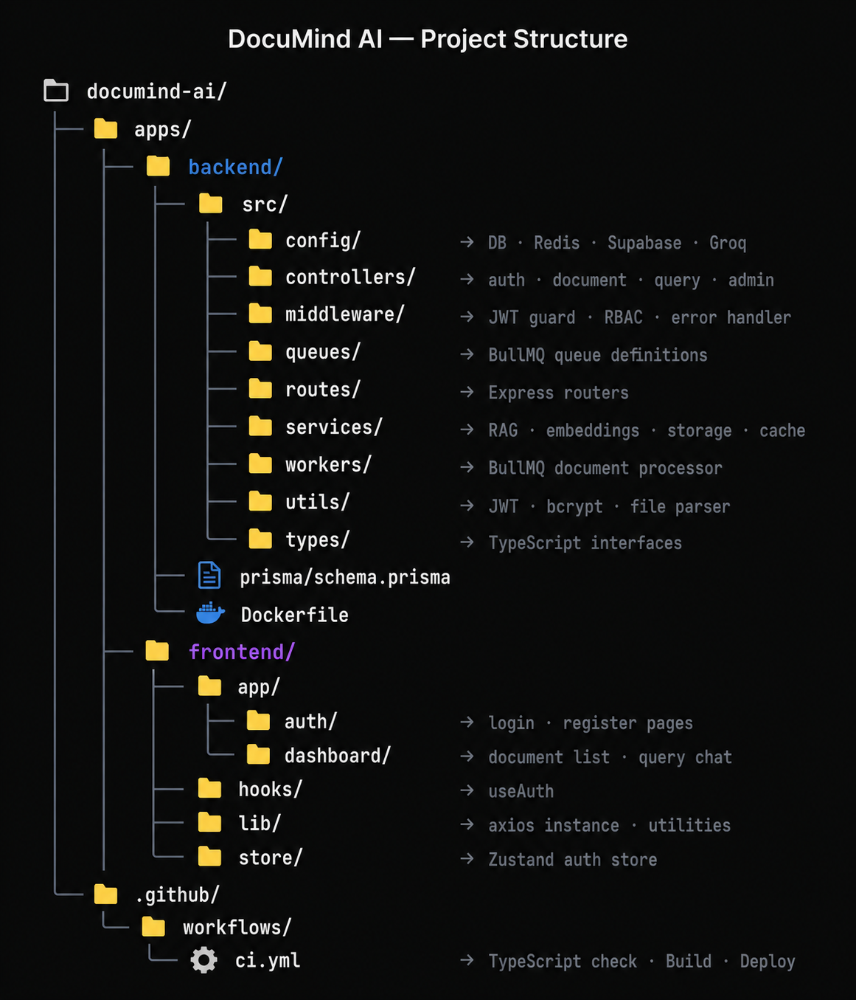

# DocuMind AI 🤖

> Upload any document. Ask questions. Get AI-powered answers with source citations.

**Live Demo:** https://documind-ai-zeta.vercel.app  
**API (health):** https://documind-ai.mooo.com/health

---

## Architecture


## RAG Pipeline



## Tech Stack

| Layer | Technology |
|-------|-----------|
| Frontend | Next.js 14 (App Router), TypeScript, Tailwind CSS |
| Backend | Node.js, Express.js, TypeScript |
| Database | PostgreSQL (Supabase) + PGVector extension |
| Cache | Redis (Upstash) |
| Queue | BullMQ |
| AI/LLM | Groq API (Llama 3.3 70B + Llama 3.1 8B) |
| Embeddings | HuggingFace (all-MiniLM-L6-v2, 384-dim) |
| Vector Search | PGVector cosine similarity |
| Auth | JWT + RBAC (User/Admin roles) |
| Storage | Supabase Storage |
| Deployment | Vercel (frontend) + AWS EC2 (backend) |
| CI/CD | GitHub Actions |
| Containerization | Docker |

## Features

- **Document Upload** — PDF, DOCX, TXT up to 10MB
- **Async Processing** — BullMQ queue with retry logic (3 attempts, exponential backoff)
- **RAG Pipeline** — chunk → embed → store → retrieve → generate
- **Confidence Scoring** — LLM-as-judge pattern scores every answer 0.0–1.0
- **Redis Caching** — identical queries served instantly from cache
- **JWT Auth** — secure register/login with bcrypt (12 rounds)
- **RBAC** — User and Admin roles with protected routes
- **Admin Dashboard** — total users, documents, queries, avg confidence
- **Rate Limiting** — 20 queries/hour per user

## Local Setup

### Prerequisites
- Node.js 20+
- Git

### 1. Clone
```bash
git clone https://github.com/ksudip17/documind-ai.git
cd documind-ai
```

### 2. Backend setup
```bash
cd apps/backend
npm install
cp .env.example .env
# Fill in .env with your credentials (see below)
npx prisma db push
npm run dev
```

### 3. Frontend setup
```bash
cd apps/frontend
npm install
cp .env.local.example .env.local
# Set NEXT_PUBLIC_API_URL=http://localhost:5001/api
npm run dev
```

### Required Environment Variables

**Backend `.env`:**
```env
PORT=5001
NODE_ENV=development
JWT_SECRET=your_jwt_secret_min_32_chars
JWT_EXPIRES_IN=7d
DATABASE_URL=postgresql://...
DIRECT_URL=postgresql://...
REDIS_URL=rediss://...
GROQ_API_KEY=gsk_...
HUGGINGFACE_API_KEY=hf_...
SUPABASE_URL=https://...supabase.co
SUPABASE_ANON_KEY=eyJ...
SUPABASE_SERVICE_KEY=eyJ...
FRONTEND_URL=http://localhost:3000
```

**Frontend `.env.local`:**
```env
NEXT_PUBLIC_API_URL=http://localhost:5001/api
```

For the **production** frontend (for example Vercel), set `NEXT_PUBLIC_API_URL` to `https://documind-ai.mooo.com/api` so the app calls the EC2-hosted API. The health check lives at `/health` (not under `/api`).

### Third-party services & hosting
| Service | Notes |
|---------|-------|
| Supabase | 500MB DB, 1GB storage (free tier) |
| Upstash | 10,000 req/day (free tier) |
| Groq | Free LLM API |
| HuggingFace | 1000 inference/day (free tier) |
| Vercel | Unlimited hobby deploys |
| AWS EC2 | Backend API (self-hosted; replaces Render after free tier expired) |

## API Reference

### Auth
POST /api/auth/register    → { token, user }
POST /api/auth/login       → { token, user }
GET  /api/auth/me          → { user }  [protected]

### Documents
POST /api/documents/upload → { document }  [protected, multipart]
GET  /api/documents        → { documents } [protected]
GET  /api/documents/:id    → { document }  [protected]
DELETE /api/documents/:id  → { message }   [protected]

### Query
POST /api/query            → { answer, sources, confidenceScore, tokensUsed, responseTimeMs, cached }
GET  /api/query/history/:documentId → { logs }

### Admin
GET /api/admin/stats       → { stats, documentsByStatus, recentQueries } [ADMIN only]
GET /api/admin/users       → { users } [ADMIN only]

## Project Structure


## Author

**Sudip Khatiwada**  
Backend Developer | Node.js + AI/ML 
[GitHub](https://github.com/ksudip17) · [LinkedIn](https://www.linkedin.com/in/sudipkhatiwada/)
